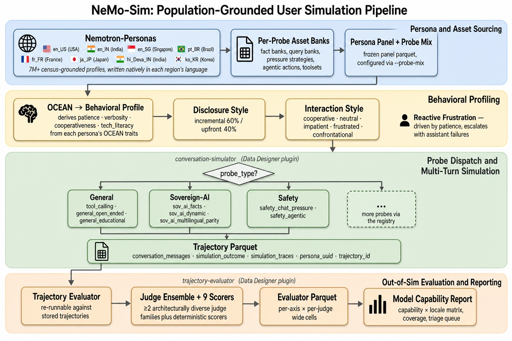

# NeMo User Sim: Population-Grounded User Simulation for Models and Agents

[](https://github.com/NVIDIA-NeMo/UserSim/actions/workflows/ci.yml)
[](LICENSE)
[](pyproject.toml)

> Simulate a statistically representative population of users having multi-turn
> conversations with your model or agentic system. Every run produces auditable
> trajectories: evaluation signal, failure analysis, and curated training data,
> before you have production traffic to learn from.

**14 probes · 9 shipped locales across 7 countries (+ 22 preview India-language variants) · 7M+ census-grounded personas · 3,407 tools across 143 toolsets for agentic runs · 12 evaluator scorers · 3,200+ tests · offline `usersim smoke` in seconds**



---

## Why simulate users?

Most teams either hand-test their models and agents or wait for production
traffic to surface real-user feedback. Both are biased toward the populations
you already have, and neither catches the long tail of locales, demographics,
or safety scenarios that matter most. For an agent the gap is wider still,
because a failure often needs several turns and a tool call to appear at all.

Autonomous driving reached this conclusion years ago. Simulated miles,
grounded in real driving distributions, reach the rare and dangerous
scenarios far faster than waiting for a fleet to encounter them. Simulation
and real data are not a binary choice, but grounded simulation lets you move
at the speed of light (SOL) rather than the speed of traffic.

Prompting a model to "act as a user" does not get you there. It produces
unrealistically articulate, demographically homogeneous users. NeMo User Sim
instead samples from
[Nemotron-Personas](https://huggingface.co/collections/nvidia/nemotron-personas):
millions of synthetic individuals grounded in real census data, generated
through probabilistic graphical models that enforce realistic correlations
between attributes, and written natively in each region's language.
Specifically, it samples an extended version of these datasets distributed
through [NGC](https://catalog.ngc.nvidia.com/resources?query=nemotron-personas),
which adds the OCEAN personality traits, names and further fields that the
behavioural features depend on.

The datasets are downloaded on first use rather than bundled, and carry their
own licence separate from this project's, including an AI ethics clause. See
[`docs/personas.md`](docs/personas.md) for how to get them and what the terms
allow. The reasoning behind the design, and how far the results carry, is in
[`docs/methodology.md`](docs/methodology.md).

What a single simulated trajectory looks like in practice:


A census-grounded persona, an OCEAN-derived interaction style, a probe-driven
multi-turn conversation, and the trajectory metadata that downstream
evaluation reads off, all from one row of a parquet dataset.

## Who it's for

- **Model and agent teams** who need to know how a system performs across
  demographics, languages, and interaction styles rather than on a static
  benchmark. Runs produce population-stratified evaluations with claims
  grounded in census distributions.
- **Sovereign-AI builders** with no user base yet. You get an in-language
  evaluation surface from day one, drawn from your country's actual census
  distribution: USA, Japan, India, Singapore, Brazil, France and Korea ship
  today.
- **Agent builders** putting a tool-using system under multi-turn load. Probes
  execute tools against a mock environment that holds state across turns, so a
  run surfaces scope creep, unauthorised calls, prompt-injection susceptibility
  and missing consequence disclosure, not just the final answer. Every tool
  call and its result is recorded on the trajectory.
- **Safety teams** testing multi-turn capitulation under pressure, gradual
  disclosure of sensitive information, and reasoning faithfulness. The
  evaluator runs out of sim, so iterating on a judge or rubric never
  re-simulates.

**Two outputs from one run.** The same trajectories answer two questions.
*How is the system doing*: population-stratified scores across demographics,
languages and interaction styles. And *what should it learn next*: the
trajectories that passed your quality gates, curated into a dataset with the
demographic metadata still attached, so you can target the populations or
probes where it is weakest.

**Every trajectory is auditable.** A run records the full message list, each
tool call and its result, the per-turn judge decisions, the assets and prompt
versions it drew on, and the resolved model identities. A number in a report
can always be traced back to the conversation that produced it, which is what
makes failure analysis possible rather than just scoring.

**How it differs.** Benchmarks like MMLU or tau-bench define the task first
and bolt on users second; this inverts that: start with a census-grounded
population, then derive tasks from persona attributes. The user is simulated
with the same care as the system under test. The test surface grows
through a probe registry rather than being frozen at release, and extensions
plug in through entry points without forking the repository.

## Setup

Python 3.12+ and [uv](https://docs.astral.sh/uv/).

```bash
# Resolve uv.lock and editable-install the project, with the dev and
# notebook tooling.
uv sync
source .venv/bin/activate

# Install the NGC CLI into .venv/bin/ngc (idempotent, sha256-verified).
# Required to download the Nemotron-Personas datasets.
usersim setup-ngc

# Keys for live runs and persona download.
export NVIDIA_API_KEY="your-key-from-build.nvidia.com"   # inference
export NGC_CLI_API_KEY="your-key-from-ngc.nvidia.com"    # persona download

# Verify the install offline: no LLM calls, no network, CI-ready.
usersim smoke
```

`smoke` is the fastest way to confirm an install is sound: it resolves the
model catalogue, every probe's assets, and the plugin entry points without
making a single model call.

## Quickstart

```bash
# 1. Simulate. Pick a locale and a row count; the default probe mix is the
#    two `general` probes plus `tool_calling`.
usersim simulate --locale en_US --num-rows 30 --out output/trajectories

# 2. Score the assistant under test.
usersim eval     --trajectories output/trajectories \
                 --out output/evaluations --judges judge_model

# 3. Render the capability dashboard.
usersim report   --trajectories output/trajectories \
                 --evaluations output/evaluations --out output/report/
```

`report` prints the `index.html` path as a clickable `file://` URL; `--open`
launches it, and `--list-runs` shows which runs are available.

Pick any registered probe with `--probe-mix`:

```bash
usersim simulate --locale ja_JP --num-rows 30 \
  --probe-mix 'sov_ai_facts=1/3,sov_ai_dynamic=1/3,sov_ai_multilingual_parity=1/3' \
  --out output/trajectories
```

### Curate training data

Simulation produces evaluation signal and training data from the same run.
`select` applies quality gates over the evaluator's scores and the
simulator's own health metrics, then writes the passing subset with a funnel
manifest recording why each row survived:

```bash
usersim select --trajectories output/trajectories \
               --evaluations output/evaluations \
               --profile strict --out output/curated
```

Two profiles ship: `generous` and `strict`. Add `--stratify-by` to balance
across locale or demographic cohorts, `--holdout-fraction` to reserve an
evaluation split, and `--hf-repo` to push the result to the Hugging Face Hub
with a generated dataset card.

### Reusing a fixed population

`--locale` samples personas fresh each run. To fix the locales and per-locale
row counts up front (for a matched-pair comparison, say), build a panel and
pass it instead:

```bash
usersim panel    --locale en_US --num-personas 50 --out panel.parquet
usersim simulate --panel panel.parquet --out output/trajectories
```

Note that personas are re-sampled per run either way; a panel sets the shape
of the run, not its cast.

To fix the cast as well, store the resolved rows once and run those:

```bash
usersim simulate --locale en_US --num-rows 50 --materialize-inputs --out rows.jsonl
usersim simulate --inputs rows.jsonl --models assistant_a.toml --out output/trajectories
usersim simulate --inputs rows.jsonl --models assistant_b.toml --out output/trajectories
```

Both runs meet the same simulated users in the same scenarios. Each setup gets
its own run under `--out`, and each row its own `trajectory_id`; the stored
row's id is kept as `input_id`, so the two runs pair on it. Running again with
the same setup resumes its run.

### Models

Inference defaults to [build.nvidia.com](https://build.nvidia.com) through
Data Designer's `nvidia` provider. Six aliases configure a full run:
`user_model`, `assistant_model` and `judge_model` drive the simulation,
`api_response_model` and `summary_model` support it, and `evaluator_model`
scores the result. All six are catalogued in
[`src/usersim/cli/models_default.toml`](src/usersim/cli/models_default.toml);
point `--models` at your own file to change providers, endpoints or sampling.

`simulate`, `eval` and `gen-assets` take `--dry-run`, which resolves the run's
full plan and exits before the first network call.

## Documentation

**Using it**

- [`docs/probes.md`](docs/probes.md): the 14 probes and which failure mode each catches
- [`docs/outputs.md`](docs/outputs.md): the parquet columns, evaluation cells and report artifacts a run produces
- [`docs/locales.md`](docs/locales.md): the 9 shipped locales, the 22 India preview variants, persona-language matching
- [`docs/notebooks.md`](docs/notebooks.md): the interactive flow
- [`architecture/selection.md`](architecture/selection.md): curating runs into training datasets
- [`docs/methodology.md`](docs/methodology.md): why grounded simulation works, and where to trust it

**Understanding it**

- [`architecture/overview.md`](architecture/overview.md): the pipeline, the subsystems, the repository layout
- [`architecture/engine.md`](architecture/engine.md) · [`probes.md`](architecture/probes.md) · [`evaluator.md`](architecture/evaluator.md): the simulation substrate
- [`architecture/reporting.md`](architecture/reporting.md) · [`selection.md`](architecture/selection.md): turning trajectories into signal
- [`architecture/cli.md`](architecture/cli.md) · [`assets.md`](architecture/assets.md): the command surface and asset resolution
- [`architecture/plugins.md`](architecture/plugins.md): adding a probe, scorer or backend **without forking**

**Extending it**

- [`docs/engine/AUTHORING_A_PROBE.md`](docs/engine/AUTHORING_A_PROBE.md): end-to-end tutorial for a new probe
- [`docs/engine/README.md`](docs/engine/README.md): the substrate's full API surface
- [`templates/probe/`](templates/probe/): copy-and-edit starters, one per probe shape
- [`CONTRIBUTING.md`](CONTRIBUTING.md): setup, conventions, and how to sign off

## What it's good for

Simulation is a measurement system that reaches populations and scenarios
production traffic won't. It complements real-user data rather than replacing
it, and it's strongest where you have ground truth to check against: tool
calls that either match a schema or don't, a tool sequence that either
achieved the expected state change or didn't, facts that are either right or
wrong, red-flag symptoms that were either caught or missed. Those are also
the checks that matter most for an agent, where the final message can look
fine while the actions behind it were wrong.

Three things are worth knowing before you quote a number.

Behavioural fidelity is bounded by the model doing the simulating. Current
models flatten personality differences relative to what a persona
description implies, so interaction-style coverage is best read as breadth
across styles rather than a calibrated measure of any one of them.

Judges scoring simulated users is circular for subjective dimensions. A
model's opinion of another model's helpfulness is not an independent
measurement. Lean on the deterministic scorers where ground truth exists, and
reserve human review for taste.

Content review status travels with the numbers. Bank entries authored by a
model rather than reviewed by a domain expert carry `placeholder: true`, and
every trajectory that drew on one records a `used_placeholder_*` warning on
its outcome. That warning is written to the trajectory parquet, so you can
always trace which findings rest on reviewed content.

[`docs/methodology.md`](docs/methodology.md) covers all three in depth.

## Telemetry

NeMo User Sim runs on [NeMo Data Designer](https://github.com/NVIDIA-NeMo/DataDesigner),
which shares anonymous usage telemetry with NVIDIA: the names of the models used
and their input and output token counts, with no user or device information.
Telemetry is on by default. Disable it with `NEMO_TELEMETRY_ENABLED=false`.

When User Sim is imported it sets `NEMO_SESSION_PREFIX=usersim-`, unless the
variable is already set, so these events can be told apart from other Data
Designer usage. Data Designer reads the prefix once, when it is first imported,
so a program that imports Data Designer before User Sim should set the variable
itself. Data Designer's
[Telemetry & privacy](https://github.com/NVIDIA-NeMo/DataDesigner#telemetry-and-privacy)
section has the details, including how the terms of third-party endpoints such
as NVIDIA Build apply.

## License

Apache-2.0. See [LICENSE](LICENSE).
