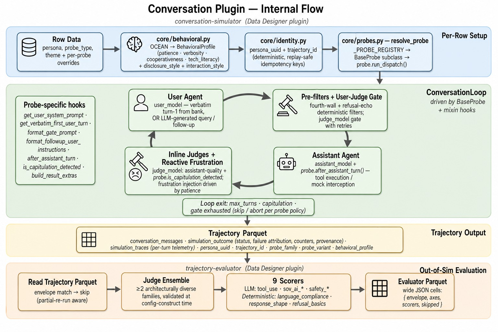

# Architecture overview

Every NeMo UserSim run answers four questions in order: **who** is the user,
**how** do they behave, **what** are they trying to do, and **how well** did
the assistant handle it. Each is a separate layer you can replace without
touching the others, which is the whole design in one sentence.


**Who** comes from [Nemotron-Personas](https://huggingface.co/collections/nvidia/nemotron-personas):
synthetic individuals grounded in real census distributions, sampled from the
extended NGC version that carries the OCEAN traits, and downloaded on first
use. Swap in your own population source and everything downstream keeps
working.

**How** is behaviour. A persona's OCEAN traits become an interaction style, a
disclosure pattern, and a tendency to push back when the assistant
underperforms. This is what separates a simulated population from a prompt
that says "act as a user."

**What** is a probe: the interaction pattern, the opening turn, and the
definition of failure. Thirteen ship; adding one is roughly fifty lines.

**How well** is the evaluator, and it runs *after* simulation rather than
inside it. Trajectories land in a parquet file, and scoring reads that file.
Rewrite a rubric, re-score in seconds, never re-simulate.

## The data flows one way

```
config → generation → storage → reporting → selection
```

Nothing downstream is imported by anything upstream. That constraint is why
`usersim.taxonomy` exists: capability definitions are needed at both ends:
at configuration time to validate a probe mix, and at reporting time to build
the matrix. Putting them in `reporting` would have made configuration import
the reporting layer and invert the flow. A shared package below both keeps
the arrow pointing one direction, and a test enforces it.

## Where to look

| Package | Responsibility | Detail |
|---|---|---|
| `usersim.cli` | The command surface, and resolving which models a run uses | [cli.md](cli.md) |
| `usersim.engine` | Running conversations: the loop, probes, banks, identity, storage | [engine.md](engine.md) |
| `usersim.engine.evaluator` | Scoring assistants: judges, axes, deterministic scorers | [evaluator.md](evaluator.md) |
| `usersim.reporting` | Turning parquets into a capability dashboard | [reporting.md](reporting.md) |
| `usersim.selection` | Curating trajectories into exportable datasets | [selection.md](selection.md) |
| `usersim.taxonomy` | The shared vocabulary of capabilities and evidence | above |
| `usersim.asset_gen` | Generating new asset banks for a domain | [assets.md](assets.md) |
| `usersim.testing` | Conformance checks for extensions you write | [plugins.md](plugins.md) |

Probes get their own page: [probes.md](probes.md) for the substrate,
[`docs/probes.md`](../docs/probes.md) for the catalogue. The entry-point
seams that let an installed package join any registry are in
[plugins.md](plugins.md).

## Built on Data Designer

The simulator and evaluator are
[Data Designer](https://nvidia-nemo.github.io/DataDesigner/) column
generators:

- `conversation-simulator` → `usersim.engine.plugin:conversation_simulator`
- `trajectory-evaluator` → `usersim.engine.plugin:trajectory_evaluator`



You inherit Data Designer's orchestration, parallelism and provider handling
rather than reimplementing them, and the two generators compose with anything
else in a Data Designer pipeline.

One naming caution: Data Designer calls its own extension mechanism
*plugins*. The seven `usersim.*` entry-point groups described in
[plugins.md](plugins.md) are a separate system, called *extensions*
throughout, so a name tells you which one you are reading about.

## Repository layout

```
src/usersim/
├── cli/               console driver; models_*.toml catalogues
├── engine/
│   ├── core/          the conversation loop, probe base classes, banks,
│   │                  identity, outcomes, storage
│   ├── evaluator/     judges, axes, and the scorer registry
│   ├── probes/        the shipped probes
│   ├── assets/        per-probe YAML and parquet banks
│   └── plugin.py      the two Data Designer entry points
├── reporting/         capability dashboard and model comparison
├── selection/         trajectory curation and export
├── taxonomy/          capability definitions, evaluation-cell decoding
├── asset_gen/         asset-bank generation
└── testing/           conformance suites for extension authors

architecture/          this directory
docs/                  guides for using the framework
templates/probe/       copy-and-edit starters, one per probe shape
tests/                 the suite; tests/engine mirrors src/usersim/engine
```
