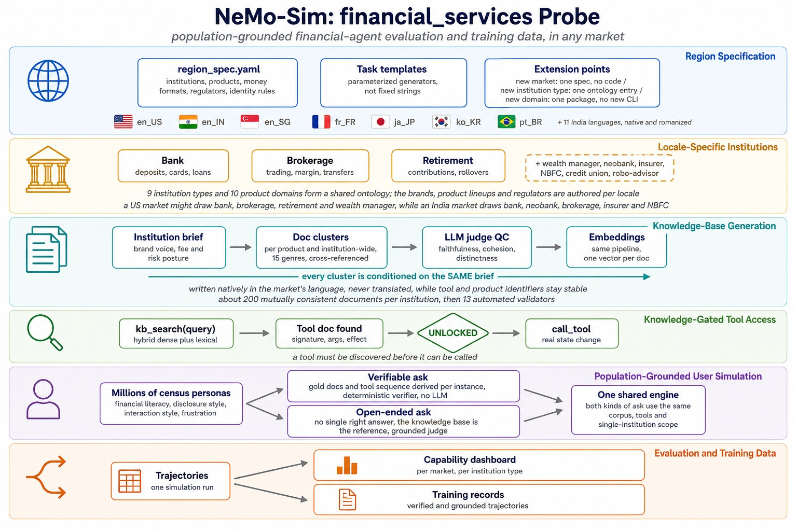
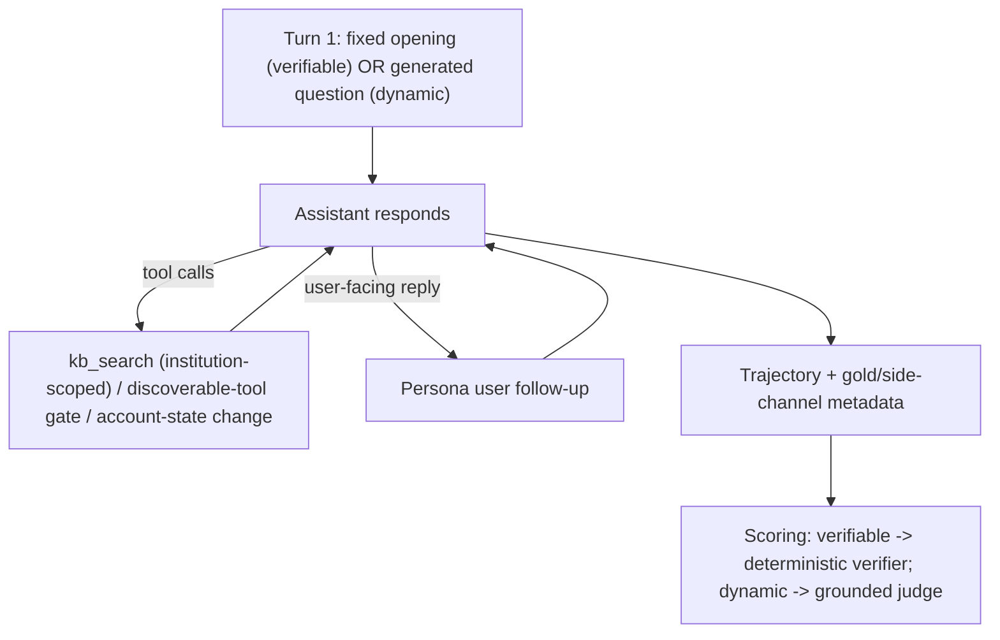

# The `financial_services` probe

`financial_services` simulates realistic conversations between census-grounded
synthetic users and an AI assistant acting as a financial institution's
support / advisory agent, then scores how well the assistant does. Conversations
span many institution types (banks, brokerages, retirement providers, wealth
managers) and product domains, run in the user's own language, and are grounded
in each institution's own knowledge base. The same runs serve two purposes:

- **Evaluation**: how well does the assistant handle a variety of financial
  tasks, per region/language and per institution type?
- **Training data**: the same trajectories yield high-quality, verifiable and
  grounded training records.

It is inspired by tau-Banking but built as a first-class, population-grounded,
multilingual NeMo UserSim probe. "Financial services" is deliberately **not one
retail bank**: a locale is a set of **institutions** (brands), each spanning one
or more **domains** (retail banking, brokerage/investing, retirement/401k-IRA,
wealth management, ...). Retrieval, tools, and scoring are always scoped to a
single institution.

At a glance:



The diagram describes the approach, not current coverage. Two markets are built
today: `en_US` (4 institutions, 851 documents, 70 verifiable tasks) and `en_IN`
(5 institutions, 1066 documents, 60 tasks). `hi_Deva_IN` has a generated corpus
but no task set yet, so it cannot be simulated; the remaining shipped locales
have the persona substrate in place but no region spec. See
[Authoring a new locale](#authoring-a-new-locale).

> For the asset-bank contract see
> [SCHEMA.md](../../assets/financial_services/SCHEMA.md). A file-by-file
> code map is at the [bottom of this document](#code-layout).

## Two tiers

A task is a parameterized generator, not a fixed string, so open-ended
persona-driven variety and deterministic checkability can coexist. Every
conversation is instantiated at one of two tiers:

| Tier | First user turn | Ground truth | Scoring |
|---|---|---|---|
| **`verifiable`** | a param-locked opening (e.g. "dispute this charge") | a derived gold spec (which docs, which tool sequence, which state change) | a deterministic verifier |
| **`dynamic`** | an open-ended question generated from an authored topic taxonomy | none: the knowledge base is the reference | a reference-grounded LLM judge |

The `dynamic` tier fills a specific gap: **open-ended but grounded** questions
("help me choose", "explain my options") where there is no single right answer,
but the assistant must ground its response in the institution's knowledge base,
stay faithful to the institution's numbers, respect the advice boundary
(education vs. individualized advice), and not invent products or fees. (Closed
factual recall belongs in `sov_ai_facts`; ungrounded open-ended exploration
belongs in `sov_ai_dynamic`.)

## Why it's a NeMo UserSim probe

- **Census-grounded personas**: population-scale, demographically diverse users
  rather than a fixed cast; the engine for scaling across users and regions.
- **Native multilingual + regional grounding**: corpora and conversations in
  the locale's own language and regulatory context.
- **Behavioral realism**: personality, incremental disclosure, and a derived
  financial-literacy level shape *how* a user pursues their goal.
- **One flywheel**: the same trajectories power both the capability dashboard
  and the training-data records.

## Institutions and domains

A locale contains several institutions; each institution has a type
(`bank` / `brokerage` / `retirement_provider` / `wealth_manager` / ...) and
offers one or more domains (`retail_banking`, `brokerage_investing`,
`retirement`, `wealth_management`, ...). Institution type and domain are
first-class keys on every document, tool, and task. A conversation is grounded
in exactly one institution, and knowledge-base search is scoped to that
institution: a brokerage's agent never retrieves a bank's documents.

## How a conversation runs

Turn 1 is either the task's fixed opening (`verifiable`) or an open-ended
question generated in the persona's voice from a topic invitation + hint
(`dynamic`). From there the user and assistant converse multi-turn. On each
assistant turn the probe runs a scoped inner tool loop:



- **Knowledge-base search** (`kb_search`) returns whole documents scoped to the
  institution.
- **Discoverable tools** follow the tau-Banking mechanic: a tool is only callable
  once a document describing it has been retrieved.
- **Account state** is a lightweight in-memory record mutated by tool calls, so
  within-conversation responses stay consistent.
- A `verifiable` conversation is only considered complete once the assistant has
  actually performed a tool action; `dynamic` conversations end when the user's
  question is resolved.

## The `dynamic`-tier taxonomy

The open-ended topics are authored per locale at
`assets/financial_services/<locale>/dynamic.yaml`. Each category is tagged with
the institution **type(s)** it applies to, so adding another institution of an
existing type is free, and covering a new type means authoring that type's
categories. Each category carries:

- `invitation`: a topic boundary phrased in the persona's voice (not a
  question),
- `subtopic_hints`: neighbourhoods to rotate through, so topics don't collapse
  across conversations (the loader requires two; author eight: see
  [Authoring a new locale](#authoring-a-new-locale)),
- optional `persona_affinities`: persona tags (e.g. `age:65+`,
  `financial-literacy:low`) used to steer selection toward realistic personas.

At runtime the probe picks the institution, restricts categories to that
institution's type, and deterministically selects a category + hint for the
persona.

### Population-weighted selection

Selection is deterministic but softly weighted by the persona so that
ecologically-valid topics dominate: a retiree is more likely to land on
rollovers and withdrawals, a young professional on opening a first brokerage
account, a lower-literacy user on fees and eligibility basics. The weighting is a
soft prior (it never excludes a category), so population coverage and
reproducibility are both preserved, and the resulting scorecard reflects a
realistic population mix rather than a uniform topic average.

## Retrieval

Whole documents only (no chunking), always scoped to the conversation's
institution. Three interchangeable backends:

- **`hybrid`** (default): normalised cosine similarity over precomputed
  per-document embeddings (shipped as an `embeddings.parquet` sidecar) blended
  evenly with normalised lexical overlap. **Both** tiers retrieve from the KB
  like a production support agent. Falls back to pure lexical ranking when
  embeddings or an endpoint are unavailable, so offline runs still work.
- **`dense`** (**ablation**): cosine alone. Kept so the contribution of each
  signal is measurable, not as a recommended setting: see below.
- **`golden`** (reasoning-isolation **ablation**): injects the task's gold
  documents plus nearest lexical distractors, removing retrieval quality as a
  variable so you can measure the reasoning/utilization ceiling; needs no
  embedding endpoint. Only the verifiable tier has gold documents; the dynamic
  tier has none, so `golden` degrades to lexical there.

**Why the default is hybrid rather than pure dense.** An institution's corpus is
deliberately narrow (a few hundred documents about a handful of products at one
brand, in one register), and a general-purpose embedding model does not
discriminate well inside it. Measured over the 442 `kb_search` calls of one en_IN
run, cosine-only retrieval returned `discoverable_tool_doc` for 88.8% of results
against an 11.3% corpus share, and its result sets barely varied with the query
(pairwise Jaccard 0.41-0.57 across unrelated queries, versus 0.06-0.08 for
lexical). Tool references win that margin systematically because they are short
(so less topically diluted than a long product sheet) and their bodies are dense
with the account-action vocabulary that appears in nearly every query. The
practical consequence was that the assistant answered product questions without
ever seeing the product documents. Blending in the lexical signal restores
topical discrimination while cosine still supplies paraphrase matching.

The mode is selected at run time with `--finance-retrieval-mode` (`usersim
simulate`) or `FINANCE_RETRIEVAL_MODE` (`notebooks/01_simulate.ipynb`).

**Disentangling retrieval from reasoning.** Success is scored on the verifiable
state/action outcome, *not* on retrieval. Retrieval is reported separately, on two
axes that answer different questions:

- **document recall** (`financial_retrieval_recall`): of a task's gold documents,
  how many did the agent pull into context? This is retrieval *access*. Crossing
  it with task success attributes a failure to retrieval (low recall) vs.
  policy/reasoning (high recall, still wrong), so a single primary run separates
  the two; the `golden` ablation is only needed for the aggregate reasoning
  ceiling. This mirrors the document-recall + golden-retriever methodology in
  [τ-Knowledge](https://arxiv.org/abs/2603.04370).
- **substantive share** (`financial_retrieval_quality`): of everything retrieved,
  how much carried the *facts* the customer asked about, rather than tool or
  procedure text?

The second exists because recall alone is **structurally blind** to one failure:
gold documents are derived from the procedural genres (a `policy_procedure` or
`discoverable_tool_doc` whose `mentions_tools` names a gold tool), so a retriever
that returns nothing *but* procedure still scores well on recall. That is what
happened on one en_IN run: 62% recall while 88.8% of everything retrieved was a
tool reference, and the assistant answered product questions having never seen a
product document. Unlike recall, the substantive share needs no gold, so it also
covers the dynamic tier, where it is the only retrieval signal and where an
ungrounded answer is most costly.

**Retrieval effort** is recorded per trajectory as `num_kb_searches` and the
`kb_search_queries` list. `kb_search` is a framework primitive and is deliberately
absent from `attempted_tool_names` (the verifier reads that for the
unauthorized-action check, and a search is not a domain action), so without these
columns a run that never searched and one that searched ten times would look
identical in the export. Keeping the query strings, not just the count, is what
makes the query-shaped failures visible: an empty query, the same query repeated,
or a single lookup where the task needed several.

## Scoring

Scoring is tier-aware:

- **`verifiable`**: a deterministic verifier (no LLM) reads the derived gold
  spec off the trajectory and scores tool selection, ordering, document recall,
  and absence of unauthorized state changes (`finance.*_rate`, 0–1). "Required"
  and "permitted" are distinct: the required `gold_tool_sequence` drives tool
  selection, while a template's optional `allowed_tools` lists legitimate extra
  state changes the scenario may invite (e.g. freezing a compromised card in a
  dispute), so they are not counted as unauthorized.
- **`dynamic`**: a reference-grounded LLM judge (temperature 0) sees the
  retrieved knowledge-base excerpts, the domain's regulator / advice-boundary
  context, and the conversation, and scores the domain-agnostic `dynamic.*` axes
  (1–5): grounding, numeric faithfulness, boundary adherence, no fabrication,
  graceful handling of unknowns, and self-consistency. Numeric faithfulness and
  no-fabrication are the critical axes.

Non-financial or off-tier rows are skipped cleanly (their axes are absent, not
zero), so the scorer is safe to run over mixed datasets.

## Reporting

Capability rows feed the dashboard:

- **Financial task success** (verifiable): aggregate transactional success
  (tool selection, ordering, no unauthorized state change), plus a
  **per-institution-type breakdown** so you can see how the assistant does on
  banks vs. brokerages vs. retirement vs. wealth. Institution types that aren't
  present in a locale simply show no data there.
- **Financial KB retrieval recall** (`financial_retrieval_recall`): the
  retrieval-access diagnostic (gold-doc recall), reported *beside* task success
  so retrieval failures are distinguishable from reasoning failures.
- **Financial KB retrieval quality** (`financial_retrieval_quality`): the share
  of retrieved documents carrying product facts rather than procedure. Read it
  with recall: recall high and quality low means the retriever found the tool docs
  and nothing else, so no grounding score above it can be trusted.
- **Grounded open-ended advice** (`dynamic_grounding`): a **cross-domain**
  capability keyed on the `dynamic.*` axes. Financial services is its first
  contributor; future grounded-advisory domains report on the same axes and roll
  up together.

## Training data

Every trajectory carries the metadata needed to mine training records: the gold
documents and tool sequence, the expected state change, the institution / domain
/ tier, and the retrieved and attempted items, and these are retained through
the dataset export. The two tiers map to different record types:

- **`verifiable`** → verifier-labeled tool trajectories (the deterministic
  verifier is a trustworthy reward for rejection-sampling / RL, with per-turn
  process signal available).
- **`dynamic`** → grounded supervised examples and preference pairs (grounded and
  faithful vs. ungrounded or fabricated, labeled by the judge).

Retrieval-augmented training assembles context from the gold documents plus
distractors drawn from the *same* institution. Record shaping itself lives in
the training-data extraction notebook.

## Realistic user behavior

Because `dynamic` conversations are multi-turn and persona-generated, the
simulator's behavioral-realism machinery applies: front-loading, politeness,
verbosity variation, and frustration escalation. A derived financial-literacy
level (from education and occupation) shapes how the user asks: a low-literacy
user avoids jargon and asks for the basics; a fluent user pushes for exact rates,
limits, and trade-offs and notices vague answers.

## Running it

The probe is opt-in: it is not part of the default probe mix. Run it with:

```bash
usersim simulate --locale en_US --probe-mix 'financial_services=1.0' \
  --finance-tier-mix 0.5   # 0.0 = verifiable-only (default); 1.0 = dynamic-only
```

Configuration (all optional):

- `finance_tier_mix` (`--finance-tier-mix`): probability a conversation uses the
  `dynamic` tier; `0.0` (default) means verifiable-only.
- `finance_tier`: force a single tier (`verifiable` or `dynamic`).
- `finance_retrieval_mode`: `hybrid` (default), `dense` or `golden`.
- `finance_embedding_model_alias`: the embedding model used for dense retrieval.

## Generating the assets

Assets are authored offline and committed; the runtime never generates them. A
two-phase Data Designer pipeline produces each institution's brief, then its
document clusters (with the institution's authoritative numbers), plus
embeddings. `validate-assets` runs a deterministic quality gate (numeric
faithfulness, language/script, near-duplicates, coverage, scope) and
`evaluate-assets` runs an LLM-judge scorecard. Document ids are stable across
regenerations, and a task's gold documents are derived from its tool sequence at
load time. The authoring workflow lives in
[finance_assets.ipynb](../../../asset_gen/notebooks/finance_assets.ipynb),
and the asset contract in
[SCHEMA.md](../../assets/financial_services/SCHEMA.md).

## Authoring a new locale

A locale is only as good as its task set: the corpus can be excellent while the
eval still measures very little. The conventions below are calibrated from the
`en_US` and `en_IN` builds and are what a reviewer should check a new locale
against. Field-level semantics live in
[SCHEMA.md](../../assets/financial_services/SCHEMA.md); this is the
*shape* the authored set should have.

**Reference numbers.** `en_US` ships 70 verifiable tasks across 4 institutions;
`en_IN` ships 60 across 5. Roughly **12-18 tasks per institution** is the target,
enough to cover the tool surface with depth left over.

### Verifiable tasks

- **Cover the tool surface.** Aim for a gold task per state-changing tool
  (`en_US` 98%, `en_IN` 95%). A tool that is never gold is only ever a
  distractor, so neither the discoverable-tool gate nor retrieval is tested on
  it. The exceptions worth accepting are semantic duplicates from the
  common-operations layer (`update_beneficiary` where an insurer already uses
  `add_nominee`).
- **Author real depth: ~40% of tasks at `gold_tool_sequence` length >= 3.**
  Depth 2 is barely multi-step; chained reasoning, the turn budget, and
  ordering only get exercised at 3-4. Treat "two tools" as a single task with a
  follow-up, not as the multi-step tier. Include a handful at depth 4.
- **Three or more openings per task** (`opening_user_messages`). The gold spec is
  fixed but turn-1 wording is not, so the same task probes the assistant through
  different phrasings, registers, and levels of user articulacy instead of
  becoming a single memorized string. Every shipped task carries exactly three.
- **Keep `ordered` off unless the whole chain is dependent.** It gates the
  entire sequence, so a genuine-prefix-plus-interchangeable-tail chain (open
  account -> nominee -> alerts) fails a correct agent on order alone. Only a
  minority of deep tasks qualify: 2 of 28 in `en_US`, 7 of 20 in `en_IN`.
- **Use `allowed_tools` for what the scenario invites.** A fraud dispute that
  makes freezing the card reasonable should permit it, or a helpful agent is
  scored as taking an unauthorized action.
- **Pin the parameters the opening names.** If the user says "card ending 0001",
  the seeded `account_state` must contain that card, or the agent resolves
  against something the user never mentioned.
- **Only use persona tags a persona can actually carry.** See the table in
  SCHEMA.md. An unreachable tag doesn't error: the task just never gets
  selected.

### Dynamic-tier taxonomy

- **Two type-specific categories per institution type, plus a cross-cutting
  layer.** One category per type means every conversation grounded in that
  institution draws the same topic. The cross-cutting categories (lifecycle,
  KYC/documents, beneficiaries, money movement, security, complaints) apply to
  several types at once, so each institution ends up drawing from several
  categories rather than one: 4-8 per type in `en_US` (14 categories total),
  7-8 in `en_IN` (16).
- **Eight subtopic hints per category**, so topics rotate rather than collapse.
- **Make ~20-30% of hints comparative or multi-document** ("how X, Y and Z
  compare on ...", "the full cost of ... end to end"). A grounded answer then
  requires synthesizing across several documents: several `kb_search` calls,
  which is what drives retrieval depth in a tier that has no gold sequence to
  force it.
- **Set `persona_affinities` from the same reachable vocabulary**, so the
  population weighting actually applies.

### Sanity checks before freezing

Measure rather than eyeball: every one of these caught a real defect:

1. Depth histogram and the share at >= 3.
2. State-changing tools with no gold task, per institution.
3. Openings per task (should be uniformly >= 3).
4. `ordered: true` chains, re-read pair by pair.
5. Every authored tag checked against the reachable vocabulary
   (`TestAuthoredPersonaTagsAreReachable` enforces this in CI).
6. Task selection simulated over a spread of personas: every task should be
   reachable at least once.
7. `param_space` keys all referenced, and every `{{slot}}` declared.

## Extending to a new domain

The dynamic-tier machinery is domain-agnostic. A new grounded-advisory domain
(e.g. healthcare, insurance) ships as its **own** probe rather than being folded
into finance; the domains only meet again at the reporting layer, on the shared
`dynamic.*` axes. To add one:

1. A bank/entity loader and its scope key (finance uses `Institution`).
2. An authored per-locale `dynamic.yaml` with entity-type-tagged categories.
3. A boundary-context source (finance uses regulator text + an advice boundary).
4. A persona → entity mapping.
5. Reuse the shared taxonomy machinery, the tool-loop mixin, and the grounded
   judge axes, and add the new probe as a contributor to the
   `dynamic_grounding` capability.

## Design guarantees

- **Scope integrity**: a task's gold documents and tools must belong to its own
  institution (enforced at load time); retrieval never crosses institutions; the
  judge uses the domain-appropriate regulator context.
- **Reproducibility**: task instantiation and selection are seeded from the
  persona, task, and run seed, so re-runs are idempotent and matched pairs line
  up. A contract version pins the gold-derivation logic independently of the
  asset version.
- **Determinism where it matters**: document ids are stable across
  regenerations; the `dynamic` judge runs at temperature 0.
- **Guarded contracts**: CI loads every committed bank, and tests keep the
  trajectory columns, the export schema, and the shared taxonomy loader in sync.

## Relationship to tau-Banking

Shared with tau-Banking: knowledge-grounded retrieval, the discoverable-tool
mechanic, gold ground truth for verifiable tasks, and whole-document retrieval.

Different here: scoring is NeMo UserSim-native (deterministic verifier + judge axes +
capability × locale rollups) rather than `pass^k`; state is a lightweight
in-memory account record rather than a full mutable database; conversations are
multilingual across many institutions and domains rather than English-only
against a single bank; the open-ended `dynamic` tier is generated from an
authored taxonomy; and every institution is a distinct fictional brand authored
per locale (no reuse of tau-Banking's names or products).

## Deferred

- The other shipped locales (region overlays + per-locale `dynamic.yaml`).
- Healthcare / insurance as separate grounded-advisory probes.
- A cross-institution advisory tier; more finance domains as institutions
  (lending/mortgage, payments, crypto, tax).
- A live stateful environment (verifiable rewards for emergent open-ended goals);
  long-document chunking; corpus scale-up.

## Code layout

Files in this package:

| File | Responsibility |
| --- | --- |
| `generator.py` | The probe class + its hooks, the trajectory-column contract, and the entry-point shim. |
| `tools.py` | Offered-tool schemas and the discoverable-tool gate helpers. |
| `retrieval.py` | Institution-scoped whole-document retrieval (`golden` + `dense`). |
| `task_derivation.py` | Persona → tags + financial-literacy, tier choice, and institution/category selection with population weighting. |
| `prompts.py` | User-simulator prompts and behavior instruction blocks. |
| `__init__.py` | Package marker. |

Related code elsewhere:

| Concern | Location |
| --- | --- |
| Bank loader / sim-time gold | `core/finance_bank.py`, `core/finance_tasks.py` |
| Dynamic-tier taxonomy + selection (shared) | `core/probing_taxonomy.py` |
| Inner tool-loop scaffold (shared) | `core/probes.py` (`ToolExecutionMixin`) |
| Query embedding (dense retrieval) | `core/embeddings.py` |
| Scorer | `evaluator/scorers/financial_services.py` |
| Capabilities | `reporting/capabilities.py` |
| Training-export columns | `selection/schemas.py` (`finance` group) |
| Assets + schema | `assets/financial_services/<locale>/` + `assets/financial_services/SCHEMA.md` |
| Offline generation | `asset_gen/financial_services/` + `asset_gen/notebooks/finance_assets.ipynb` |
